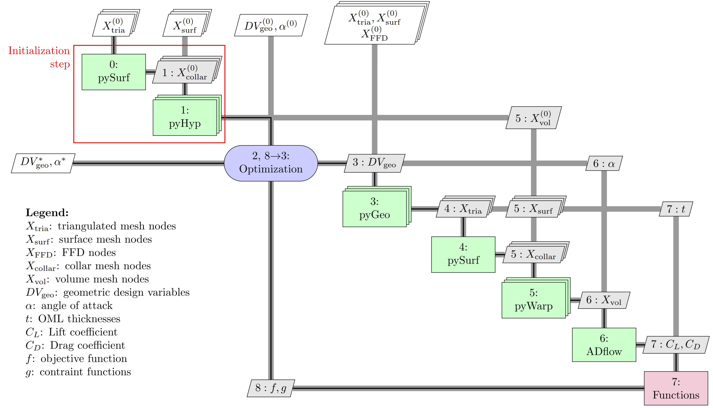

pyHyp
=====

pyHyp uses hyperbolic volume mesh marching schemes to extrude structured surface meshes into volume meshes.
pyHyp is used as a preprocessing step in the geometry and mesh-creation process prior to an optimization.

Documentation
-------------

Please see the [documentation](http://mdolab.engin.umich.edu/docs/packages/pyhyp/doc/index.html) for installation details and API documentation.
This link requires credentials currently only available to MDO Lab members.

To locally build the documentation, enter the `doc` folder and enter `make html` in terminal.
You can then view the built documentation in the `_build` folder.

Citation
--------

pyHyp is based on the theory presented in "Enhancements of a three-dimensional hyperbolic grid generation scheme."
For more background, theory, and figures, see the original [journal article](https://doi.org/10.1016/0096-3003(92)90073-A).

How pyHyp fits within MACH
--------------------------

pyHyp takes structured surface meshes and extrudes them into structured volume meshes.
This is done as a pre-processing step.
Generally, the surface meshes come from ICEM.
The pyHyp-generated volume meshes are then used in [ADflow](https://github.com/mdolab/adflow) to perform CFD.
An example [XDSM](https://github.com/mdolab/pyXDSM) for an optimization setup that uses pyHyp is shown below.

License
-------

Copyright 2019 MDO Lab. See the LICENSE file for details.
